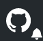
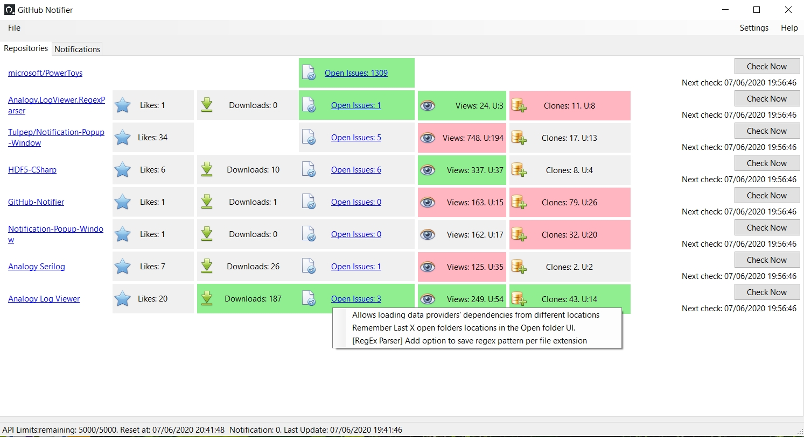

<h1 align="left">GitHub-Notifier </h1> 

    

   
 
 
                                                                                                                           

                                                                                                                               
a small program that sits in the tray bar and periodically check repositories for activity.

## How to use

1. Go to github user settings under https://github.com/settings/tokens
2. Create new token with permission for notifications, read:org, read:user, repo.
3. Add environment variable with key "GitHubNotifier_Token" (without the ") and value with the token from 2.
4. Run the app. if all is good you should see at the bottom screen "API limits: Remaining XX/5000
